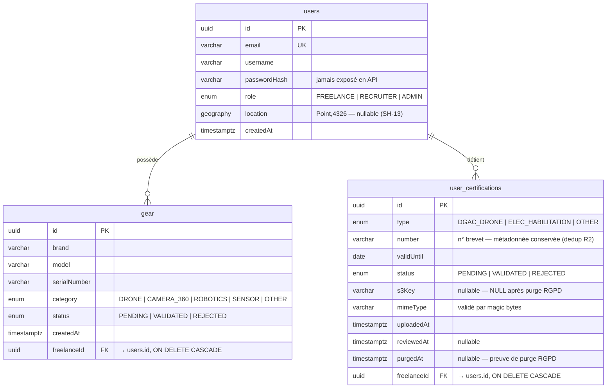
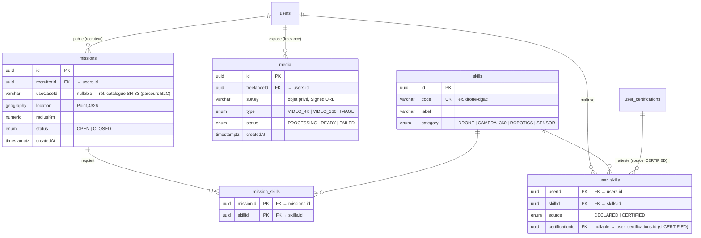

# MCD / MLD — SkillHunt

> Modèle de données. **Existant (implémenté) distingué de la cible (planifié).**
> Source de vérité = le code (`backend-core/src/**/*.entity.ts` + migrations TypeORM).
> Diagrammes en **Mermaid** (rendu GitHub/VS Code). Méthodologie **Merise**.

## 0. Périmètre & polyglotte

SkillHunt est **polyglotte** (cf. dossier §3.2.5) :
- **PostgreSQL + PostGIS** — relationnel/spatial : `users`, `gear`, `user_certifications` (+ cible : `missions`, `media`). C'est le périmètre du **MLD relationnel** ci-dessous.
- **MongoDB** — documentaire : chat (`conversations`/`messages`), logs. Schéma flexible → décrit en §4, hors MLD relationnel.
- **Redis** — éphémère : refresh tokens (jti), cache de matching. Hors modèle persistant.

> ⚠️ **Écart dossier ↔ code à réconcilier.** Le benchmark persistance du dossier (§3.2.5) range le
> **Gear Locker dans MongoDB**, mais l'implémentation (SH-9) l'a mis dans **PostgreSQL** (`gear`,
> TypeORM). Le présent modèle reflète le **code réel** (PostgreSQL). À aligner dans `SkillHunt.docx`.

Légende statut : ✅ implémenté · 🔲 cible/planifié.

---

## 1. MCD — Modèle Conceptuel de Données (Merise)

Cardinalité Merise lue côté entité = (min, max) participations d'une occurrence à l'association.

| Association | Entité A | card. A | Entité B | card. B | Statut |
|---|---|---|---|---|---|
| **possède** | UTILISATEUR | (0,n) | MATÉRIEL | (1,1) | ✅ |
| **détient** | UTILISATEUR | (0,n) | CERTIFICATION | (1,1) | ✅ |
| **publie** | UTILISATEUR (recruteur) | (0,n) | MISSION | (1,1) | 🔲 |
| **expose** | UTILISATEUR (freelance) | (0,n) | MÉDIA | (1,1) | 🔲 |
| **échange** | UTILISATEUR | (0,n) | MESSAGE | (1,1) | 🔲 |
| **maîtrise** | UTILISATEUR (freelance) | (0,n) | COMPÉTENCE | (0,n) | 🔲 |
| **requiert** | MISSION | (0,n) | COMPÉTENCE | (0,n) | 🔲 |
| **atteste** | CERTIFICATION | (0,n) | COMPÉTENCE | (0,n) | 🔲 |

- **UTILISATEUR** porte un `rôle` (FREELANCE / RECRUITER / ADMIN) — spécialisation conceptuelle
  réalisée par un attribut (table unique côté MLD), pas par héritage de tables.
- **COMPÉTENCE (skills)** devient le **hub** du modèle cible : un freelance la **maîtrise**
  (déclarée ou attestée), une mission la **requiert**, une certification l'**atteste**. Les trois
  associations N:N se réifient en tables de liaison (`user_skills`, `mission_skills`).
  > **MVP vs cible** : aujourd'hui les skills ne sont **pas stockés** — le matching les **infère**
  > du matériel validé (`CATEGORY_SKILL_MAP`, constante). La table `skills` est la **trajectoire**
  > vers un matching plus fin (R4), pas l'état codé.
- **Le matching** (Skills + Matériel + Localisation) est un **calcul** du `matching-service`, pas une
  association stockée → il n'apparaît pas au MCD (il lit `users`/`gear`, produit un score volatil,
  caché en Redis). Idem **cas d'usage SH-33** : référentiel (constante MVP), pas une entité métier.

---

## 2. MLD — Existant (✅ PostgreSQL, fidèle au code)

Index notables : `users.email` (unique), `users.location` (GiST spatial), `gear.status`,
`gear.category`, `gear.freelanceId`, `user_certifications.status`, `user_certifications.freelanceId`.

> 🔲 **Évolution cible sur `gear`** : ajout d'une colonne **`specs JSONB`** (indexable GIN) pour les
> attributs hétérogènes par catégorie (autonomie d'un drone, résolution d'une 360°…) — sans migration
> à chaque attribut. C'est l'argument qui justifie **PostgreSQL + JSONB** plutôt que MongoDB pour
> l'Armurerie (cf. §0 et §3). Enrichit SH-21.

---

## 3. MLD — Cible (🔲 PostgreSQL, à implémenter)

- **`skills`** (référentiel) est le **hub** : il relie l'inférence matériel (MVP), les déclarations
  freelance, les certifications et les besoins des missions.
- **`user_skills`** (N:N) porte l'origine du skill : `DECLARED` (saisi) ou `CERTIFIED` (accordé par
  une certification validée → `certificationId`). C'est le **lien certification → compétence**.
- **`missions`** porte **soit** `useCaseId` (parcours non-expert SH-33) **soit** des skills via
  **`mission_skills`** (parcours expert). Alimente le matching (SH-12) et le bus d'événements (SH-14).
- **`media`** (SH-18) sert le portfolio via Signed URL (réutilise `StorageService` de SH-31).
- **`use_cases`** (SH-33) : référentiel en **constante code** pour le MVP, migrable en table éditable
  par l'Admin (dossier §1.4/§1.6).
- **`gear.specs JSONB`** : attribut cible sur la table `gear` existante (cf. §2).

---

## 4. NoSQL — MongoDB (🔲 documentaire, schéma flexible)

Hors MLD relationnel (cf. dossier §3.2.5). Collections cibles :

- **`conversations`** : `_id`, `participants` [userId recruteur, userId freelance], `missionId?`,
  `createdAt`, `lastMessageAt`.
- **`messages`** : `_id`, `conversationId`, `senderId`, `body`, `attachments` [{ s3Key, mimeType }],
  `sentAt`. Transport temps réel **WSS** (SH-24).
- **`logs`** : événements de sécurité/audit (erreurs 401/403, tentatives d'injection) → stack ELK.

## 5. Éphémère — Redis (🔲)

- **Refresh tokens** : `jti` → statut (révocation/rotation), TTL natif (migration depuis le store
  mémoire actuel, SH-14).
- **Cache de matching** : résultats de recherche fréquents (clé = critères) ; bus d'événements.

---

## 6. Traçabilité tickets

| Entité / brique | Ticket | Statut |
|---|---|---|
| `users` (+ `location` PostGIS) | SH-6 | ✅ |
| `gear` | SH-9 | ✅ |
| `user_certifications` (+ purge RGPD) | SH-10 | ✅ |
| Matching (lecture `users`/`gear`) | SH-12 | 🟡 Prêt |
| `skills` + `user_skills` (déclarées / attestées) | cible (matching avancé) | 🔲 |
| `gear.specs JSONB` (specs hétérogènes par type) | SH-21 | 🔲 |
| `missions` + `mission_skills` + bus d'événements | SH-12 / SH-14 | 🔲 |
| `use_cases` (référentiel) | SH-33 | 🟡 Prêt |
| `media` (portfolio) | SH-18 | 🔲 |
| `conversations` / `messages` (Mongo) | SH-24 | 🔲 |
| Refresh tokens / cache (Redis) | SH-14 | 🔲 |
