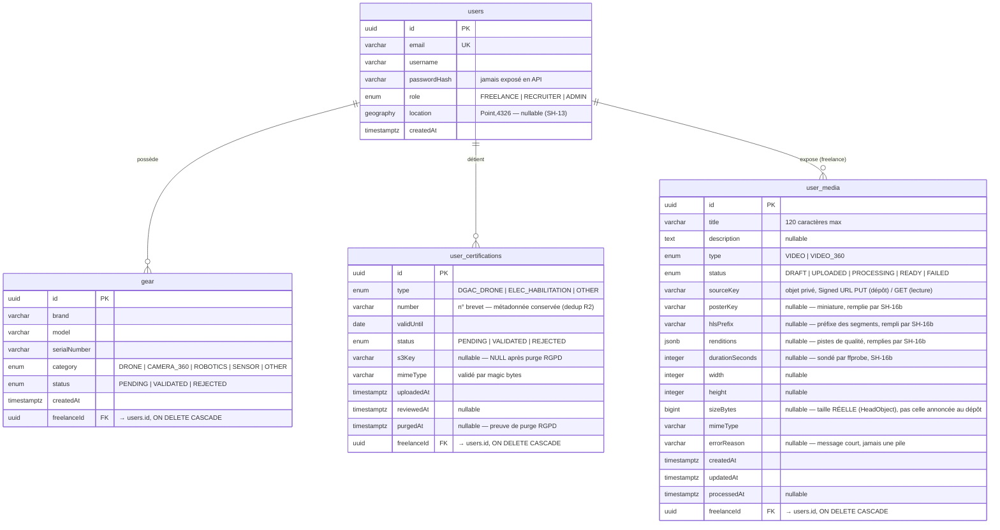
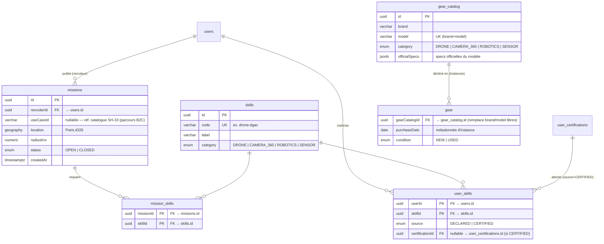

# MCD / MLD — SkillHunt

> Modèle de données. **Existant (implémenté) distingué de la cible (planifié).**
> Source de vérité = le code (`backend-core/src/**/*.entity.ts` + migrations TypeORM).
> Diagrammes en **Mermaid** (rendu GitHub/VS Code). Méthodologie **Merise**.

## 0. Périmètre & polyglotte

SkillHunt est **polyglotte** (cf. dossier §3.2.5) :
- **PostgreSQL + PostGIS** — relationnel/spatial : `users`, `gear`, `user_certifications` (+ cible : `missions`, `media`). C'est le périmètre du **MLD relationnel** ci-dessous.
- **MongoDB** — documentaire : chat (`conversations`/`messages`), logs. Schéma flexible → décrit en §4, hors MLD relationnel.
- **Redis** — éphémère : refresh tokens (jti), cache de matching. Hors modèle persistant.

> ⚠️ **Écarts conception ↔ code à réconcilier** (le présent modèle reflète le **code réel**) :
> 1. **Persistance Armurerie** : le dossier (§3.2.5) range le Gear Locker dans **MongoDB** ;
>    l'implémentation (SH-9) l'a mis dans **PostgreSQL** (`gear`, TypeORM) — à aligner (+ JSONB).
> 2. **Modèle matériel** : SCRUM-8 (conception) prévoit `gear_catalog` + jointure M:N `user_gear` ;
>    le MVP a un `gear` **plat** 1:N en texte libre. Normalisation documentée en **cible** (§3).
> 3. **Persona** : le dossier positionne le recruteur en **B2B** ; on ajoute le **B2C** non-expert
>    (SH-33). → patchs `SkillHunt.docx` à intégrer.

Légende statut : ✅ implémenté · 🔲 cible/planifié.

---

## 1. MCD — Modèle Conceptuel de Données (Merise)

Cardinalité Merise lue côté entité = (min, max) participations d'une occurrence à l'association.

| Association | Entité A | card. A | Entité B | card. B | Statut |
|---|---|---|---|---|---|
| **possède** | UTILISATEUR | (0,n) | MATÉRIEL | (1,1) | ✅ |
| **détient** | UTILISATEUR | (0,n) | CERTIFICATION | (1,1) | ✅ |
| **publie** | UTILISATEUR (recruteur) | (0,n) | MISSION | (1,1) | 🔲 |
| **expose** | UTILISATEUR (freelance) | (0,n) | MÉDIA | (1,1) | 🔲 |
| **échange** | UTILISATEUR | (0,n) | MESSAGE | (1,1) | 🔲 |
| **maîtrise** | UTILISATEUR (freelance) | (0,n) | COMPÉTENCE | (0,n) | 🔲 |
| **requiert** | MISSION | (0,n) | COMPÉTENCE | (0,n) | 🔲 |
| **atteste** | CERTIFICATION | (0,n) | COMPÉTENCE | (0,n) | 🔲 |
| **réfère** | MATÉRIEL | (1,1) | MODÈLE_MATÉRIEL | (0,n) | 🔲 |

- **UTILISATEUR** porte un `rôle` (FREELANCE / RECRUITER / ADMIN) — spécialisation conceptuelle
  réalisée par un attribut (table unique côté MLD), pas par héritage de tables.
- **réfère** : c'est **MATÉRIEL** qui est côté (1,1), donc qui **porte la clé étrangère**
  (`gear.gearCatalogId → gear_catalog.id`) — même règle de dérivation que `possède`
  (MATÉRIEL (1,1) → `gear.freelanceId`).
- **atteste** (N:N) ne se réifie **pas** en table de jonction dédiée : elle est **absorbée** dans
  `user_skills.certificationId` (FK nullable, `source = CERTIFIED`). Simplification assumée — une
  compétence attestée est toujours rattachée au freelance qui la détient, la table `user_skills`
  suffit donc à porter les deux liens. À ne pas lire comme une erreur de dérivation Merise.
- **COMPÉTENCE (skills)** devient le **hub** du modèle cible : un freelance la **maîtrise**
  (déclarée ou attestée), une mission la **requiert**, une certification l'**atteste**. Les trois
  associations N:N se réifient en tables de liaison (`user_skills`, `mission_skills`).
  > **MVP vs cible** : aujourd'hui les skills ne sont **pas stockés** — le matching les **infère**
  > du matériel validé (`CATEGORY_SKILL_MAP`, constante). La table `skills` est la **trajectoire**
  > vers un matching plus fin (R4), pas l'état codé.
- **Le matching** (Skills + Matériel + Localisation) est un **calcul** du `matching-service`, pas une
  association stockée → il n'apparaît pas au MCD (il lit `users`/`gear`, produit un score volatil,
  caché en Redis). Idem **cas d'usage SH-33** : référentiel (constante MVP), pas une entité métier.

---

## 2. MLD — Existant (✅ PostgreSQL, fidèle au code)

```mermaid
erDiagram
    users ||--o{ gear : "possède"
    users ||--o{ user_certifications : "détient"
    users ||--o{ user_media : "expose (freelance)"

    users {
        uuid id PK
        varchar email UK
        varchar username
        varchar passwordHash "jamais exposé en API"
        enum role "FREELANCE | RECRUITER | ADMIN"
        geography location "Point,4326 — nullable (SH-13)"
        timestamptz createdAt
    }

    gear {
        uuid id PK
        varchar brand
        varchar model
        varchar serialNumber
        enum category "DRONE | CAMERA_360 | ROBOTICS | SENSOR | OTHER"
        enum status "PENDING | VALIDATED | REJECTED"
        timestamptz createdAt
        uuid freelanceId FK "→ users.id, ON DELETE CASCADE"
    }

    user_certifications {
        uuid id PK
        enum type "DGAC_DRONE | ELEC_HABILITATION | OTHER"
        varchar number "n° brevet — métadonnée conservée (dedup R2)"
        date validUntil
        enum status "PENDING | VALIDATED | REJECTED"
        varchar s3Key "nullable — NULL après purge RGPD"
        varchar mimeType "validé par magic bytes"
        timestamptz uploadedAt
        timestamptz reviewedAt "nullable"
        timestamptz purgedAt "nullable — preuve de purge RGPD"
        uuid freelanceId FK "→ users.id, ON DELETE CASCADE"
    }

    user_media {
        uuid id PK
        varchar title "120 caractères max"
        text description "nullable"
        enum type "VIDEO | VIDEO_360"
        enum status "DRAFT | UPLOADED | PROCESSING | READY | FAILED"
        varchar sourceKey "objet privé, Signed URL PUT (dépôt) / GET (lecture)"
        varchar posterKey "nullable — miniature, remplie par SH-16b"
        varchar hlsPrefix "nullable — préfixe des segments, rempli par SH-16b"
        jsonb renditions "nullable — pistes de qualité, remplies par SH-16b"
        integer durationSeconds "nullable — sondé par ffprobe, SH-16b"
        integer width "nullable"
        integer height "nullable"
        bigint sizeBytes "nullable — taille RÉELLE (HeadObject), pas celle annoncée au dépôt"
        varchar mimeType
        varchar errorReason "nullable — message court, jamais une pile"
        timestamptz createdAt
        timestamptz updatedAt
        timestamptz processedAt "nullable"
        uuid freelanceId FK "→ users.id, ON DELETE CASCADE"
    }
```

Index notables : `users.email` (unique), `users.role`, `users.location` (GiST spatial), `gear.status`,
`gear.category`, `gear.freelanceId`, `user_certifications.status`, `user_certifications.freelanceId`,
`user_media.status`, `user_media.freelanceId`.

> ⚠️ **`user_media` (SH-16a) — flux entrant implémenté, recette de bout en bout NON concluante.**
> L'entité, la migration, l'upload par URL PUT présignée, le producteur BullMQ et le balayage des
> déclarations abandonnées sont livrés et couverts par les tests unitaires/intégration du service.
> La recette manuelle de clôture (Task 9, `docs/tickets/SH-16a-flux-entrant-media.md`) a cependant mis
> en évidence **deux défauts bloquants** qui empêchent la boucle réelle `DRAFT → UPLOADED → READY` de se
> fermer via la gateway : (1) l'URL de dépôt présignée embarque une somme de contrôle CRC32 calculée sur
> un contenu vide, ce qui fait rejeter par S3/LocalStack tout dépôt réel non vide ; (2) l'écouteur
> `QueueEvents` re-parse en JSON une `returnvalue` déjà désérialisée par `bullmq` (5.81.x), ce qui fait
> échouer systématiquement la transcription du résultat, quel que soit le contenu renvoyé par le worker.
> Détail, preuves et pistes de correction dans le ticket.

> 🔐 **Chiffrement au repos — état réel et écart assumé** (règle `CLAUDE.md` §8.6 : « données sensibles
> chiffrées AES-256 au repos »).
>
> | Donnée | Sensibilité | État actuel |
> |---|---|---|
> | `users.passwordHash` | — | **Argon2id** (hachage, non réversible — pas concerné par le chiffrement) ✅ |
> | Fichier de certification (S3) | Élevée (pièce officielle) | **AES-256** côté S3 (SSE) + Signed URL courte + purge des PII du PDF ✅ |
> | `user_certifications.number` | **Élevée** (n° de brevet DGAC — identifiant officiel, réutilisable pour usurpation) | ⚠️ **`varchar` en clair** — non chiffré au niveau colonne |
> | `users.location` | **Moyenne** (géolocalisation précise du domicile d'un freelance) | ⚠️ `GEOGRAPHY(Point)` **en clair** — non chiffré au niveau colonne |
>
> **Écart assumé et tracé.** Ces deux colonnes ne sont **pas chiffrées au niveau applicatif** : elles
> doivent rester **interrogeables** (déduplication anti-fraude sur `{type, number}` — risque R2 ; requêtes
> spatiales GiST `ST_DWithin` pour le matching géographique — SH-13). Un chiffrement de colonne les rendrait
> inexploitables pour ces deux usages, qui sont au cœur du produit.
>
> **Mesure compensatoire retenue** : chiffrement **au niveau du volume** (chiffrement au repos de l'instance
> PostgreSQL managée — AWS RDS `StorageEncrypted`, KMS), qui couvre l'ensemble des colonnes sans casser
> l'indexation. À **acter explicitement à la mise en production** (SH-30) ; à défaut, l'écart reste ouvert.
>
> *(Une alternative existe pour `number` : ne stocker qu'un **hash** du numéro pour la déduplication et
> chiffrer la valeur en clair — à évaluer si la valeur brute n'a pas besoin d'être réaffichée.)*

> 🔲 **Évolutions cibles sur `gear`** (cf. §3) :
> - **`specs JSONB`** (indexable GIN) pour les attributs hétérogènes par catégorie (autonomie d'un
>   drone, résolution d'une 360°…) sans migration — justifie **PostgreSQL + JSONB** plutôt que MongoDB.
> - **Normalisation `gear_catalog`** : `brand`/`model`/`category` (texte libre au MVP) extraits dans
>   un **référentiel** Admin ; `gear` les référence via `gearCatalogId` et devient la jointure
>   d'instances (rôle `user_gear` de SCRUM-8). Enrichit SH-21.

---

## 3. MLD — Cible (🔲 PostgreSQL, à implémenter)

```mermaid
erDiagram
    users ||--o{ missions : "publie (recruteur)"
    users ||--o{ user_skills : "maîtrise"
    skills ||--o{ user_skills : ""
    user_certifications ||--o{ user_skills : "atteste (source=CERTIFIED)"
    missions ||--o{ mission_skills : "requiert"
    skills ||--o{ mission_skills : ""
    gear_catalog ||--o{ gear : "décliné en (instances)"

    gear_catalog {
        uuid id PK
        varchar brand
        varchar model "UK (brand+model)"
        enum category "DRONE | CAMERA_360 | ROBOTICS | SENSOR"
        jsonb officialSpecs "specs officielles du modèle"
    }

    gear {
        uuid gearCatalogId FK "→ gear_catalog.id (remplace brand/model libres)"
        date purchaseDate "métadonnée d'instance"
        enum condition "NEW | USED"
    }

    skills {
        uuid id PK
        varchar code UK "ex. drone-dgac"
        varchar label
        enum category "DRONE | CAMERA_360 | ROBOTICS | SENSOR"
    }

    user_skills {
        uuid userId PK "FK → users.id"
        uuid skillId PK "FK → skills.id"
        enum source "DECLARED | CERTIFIED"
        uuid certificationId FK "nullable → user_certifications.id (si CERTIFIED)"
    }

    missions {
        uuid id PK
        uuid recruiterId FK "→ users.id"
        varchar useCaseId "nullable — réf. catalogue SH-33 (parcours B2C)"
        geography location "Point,4326"
        numeric radiusKm
        enum status "OPEN | CLOSED"
        timestamptz createdAt
    }

    mission_skills {
        uuid missionId PK "FK → missions.id"
        uuid skillId PK "FK → skills.id"
    }
```

- **`gear_catalog`** (référentiel curé par l'Admin — « catalogue officiel », cf. dossier §1.4/§1.6)
  normalise le matériel : `gear` (table existante §2) **évolue** pour le référencer
  (`gearCatalogId`) et ne porter que les **métadonnées d'instance** (`serialNumber`, `purchaseDate`,
  `condition`). `gear` joue alors le rôle de la jointure **`user_gear`** prévue par SCRUM-8 (M:N
  Expert↔Modèle). **MVP** : `gear` plat avec `brand`/`model` en texte libre (§2).
- **`skills`** (référentiel) est le **hub** : il relie l'inférence matériel (MVP), les déclarations
  freelance, les certifications et les besoins des missions.
- **`user_skills`** (N:N) porte l'origine du skill : `DECLARED` (saisi) ou `CERTIFIED` (accordé par
  une certification validée → `certificationId`). C'est le **lien certification → compétence**.
- **`missions`** porte **soit** `useCaseId` (parcours non-expert SH-33) **soit** des skills via
  **`mission_skills`** (parcours expert). Alimente le matching (SH-12) et le bus d'événements (SH-14).
- **`user_media`** : flux entrant livré en SH-16a (§2, ci-dessus). Reste à implémenter : le pipeline
  de transcodage réel `ffprobe`/`ffmpeg` (SH-16b) et le flux sortant — portfolio, manifeste HLS
  réécrit en segments signés (SH-17/SH-18).
- **`use_cases`** (SH-33) : référentiel en **constante code** pour le MVP, migrable en table éditable
  par l'Admin (dossier §1.4/§1.6).
- **`gear.specs JSONB`** : attribut cible sur la table `gear` existante (cf. §2).

---

## 4. NoSQL — MongoDB (🔲 documentaire, schéma flexible)

Hors MLD relationnel (cf. dossier §3.2.5). Collections cibles :

- **`conversations`** : `_id`, `participants` [userId recruteur, userId freelance], `missionId?`,
  `createdAt`, `lastMessageAt`.
- **`messages`** : `_id`, `conversationId`, `senderId`, `body`, `attachments` [{ s3Key, mimeType }],
  `sentAt`. Transport temps réel **WSS** (SH-24).
- **`logs`** : événements de sécurité/audit (erreurs 401/403, tentatives d'injection) → stack ELK.

## 5. Éphémère — Redis (🔲)

- **Refresh tokens** : `jti` → statut (révocation/rotation), TTL natif (migration depuis le store
  mémoire actuel, SH-14).
- **Cache de matching** : résultats de recherche fréquents (clé = critères) ; bus d'événements.

---

## 6. Traçabilité tickets

| Entité / brique | Ticket | Statut |
|---|---|---|
| `users` (+ `location` PostGIS) | SH-6 | ✅ |
| `gear` | SH-9 | ✅ |
| `user_certifications` (+ purge RGPD) | SH-10 | ✅ |
| Matching (lecture `users`/`gear`) | SH-12 | 🟡 Prêt |
| `skills` + `user_skills` (déclarées / attestées) | cible (matching avancé) | 🔲 |
| `gear.specs JSONB` (specs hétérogènes par type) | SH-21 | 🔲 |
| `gear_catalog` (référentiel Admin) + `gear` normalisé (`user_gear`) | SCRUM-8 / cible | 🔲 |
| `missions` + `mission_skills` + bus d'événements | SH-12 / SH-14 | 🔲 |
| `use_cases` (référentiel) | SH-33 | 🟡 Prêt |
| `user_media` (flux entrant) | SH-16a | ⚠️ implémenté, recette bloquée (2 défauts, voir ticket) |
| `user_media` (portfolio, flux sortant) | SH-17 / SH-18 | 🔲 |
| `conversations` / `messages` (Mongo) | SH-24 | 🔲 |
| Refresh tokens / cache (Redis) | SH-14 | 🔲 |
