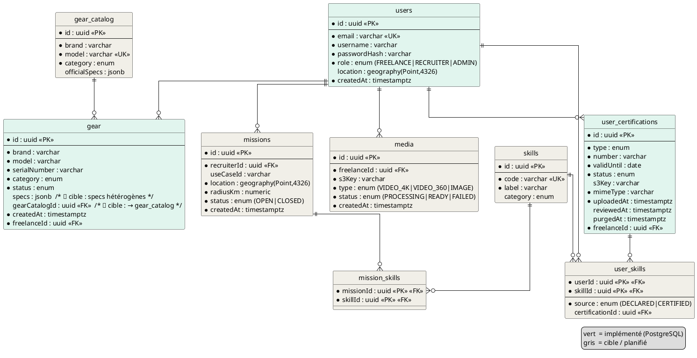

# Sources diagrammes — MCD (Mocodo) & MLD (PlantUML)

> Sources prêtes à rendre. Le modèle complet (existant ✅ / cible 🔲) est décrit dans
> `2026-06-28-MCD-MLD-SkillHunt.md`. Ici : les sources pour générer les **visuels**.

---

## A. MCD — Merise (Mocodo)

**Rendre :** copier le bloc dans **[mocodo.net](https://mocodo.net)** → bouton **Réarranger** pour la
mise en page automatique → export SVG/PNG. Mocodo dérive aussi le MLD (menu *Relationnel*).

> Cardinalité Mocodo : elle précède l'entité et exprime sa participation.
> `0N UTILISATEUR` = un utilisateur participe 0..N fois à l'association.
> Existant : `possède`, `détient`. Cible : `réfère`, `publie`, `expose`, `échange`, `maîtrise`, `requiert`, `atteste`.
> Cible `MODELE_MATERIEL` = catalogue officiel curé par l'Admin (SCRUM-8). Au MVP, `brand`/`model`/`category` sont portés directement par `MATERIEL` (texte libre) ; en cible ils migrent vers `MODELE_MATERIEL` et `MATERIEL` ne garde que les métadonnées d'instance.

```mocodo
UTILISATEUR: id, email, username, role, localisation
MATERIEL: id, serialNumber, purchaseDate, condition, statut
MODELE_MATERIEL: id, brand, model, category, officialSpecs
CERTIFICATION: id, type, number, validUntil, statut
COMPETENCE: id, code, label, category
MISSION: id, useCaseId, rayon_km, statut, createdAt, localisation
MEDIA: id, type, statut, createdAt
MESSAGE: id, body, sentAt

possède, 0N UTILISATEUR, 11 MATERIEL
réfère, 0N MATERIEL, 11 MODELE_MATERIEL
détient, 0N UTILISATEUR, 11 CERTIFICATION
publie, 0N UTILISATEUR, 11 MISSION
expose, 0N UTILISATEUR, 11 MEDIA
échange, 0N UTILISATEUR, 11 MESSAGE
maîtrise, 0N UTILISATEUR, 0N COMPETENCE: source
requiert, 0N MISSION, 0N COMPETENCE
atteste, 0N CERTIFICATION, 0N COMPETENCE
```

Notes :
- `UTILISATEUR.role` distingue freelance / recruteur / admin (table unique au MLD) ; `publie` concerne
  le recruteur, `possède`/`expose`/`maîtrise` le freelance.
- `maîtrise` porte l'attribut `source` (DECLARED / CERTIFIED) — l'association `atteste` justifie le
  cas CERTIFIED (une certification validée accorde une compétence).
- `MESSAGE` est conceptuel ici ; physiquement en MongoDB (documentaire), hors MLD relationnel.

---

## B. MLD — relationnel (PlantUML)

**Rendre :** coller dans **[plantuml.com/plantuml](https://www.plantuml.com/plantuml)**, ou VS Code
extension `jebbs.plantuml`. Vert = ✅ implémenté (PostgreSQL fidèle au code) · gris = 🔲 cible.



> `gear.specs` (jsonb) et toutes les entités grises sont **cibles** : voir la traçabilité par ticket
> dans `2026-06-28-MCD-MLD-SkillHunt.md` (§6).
